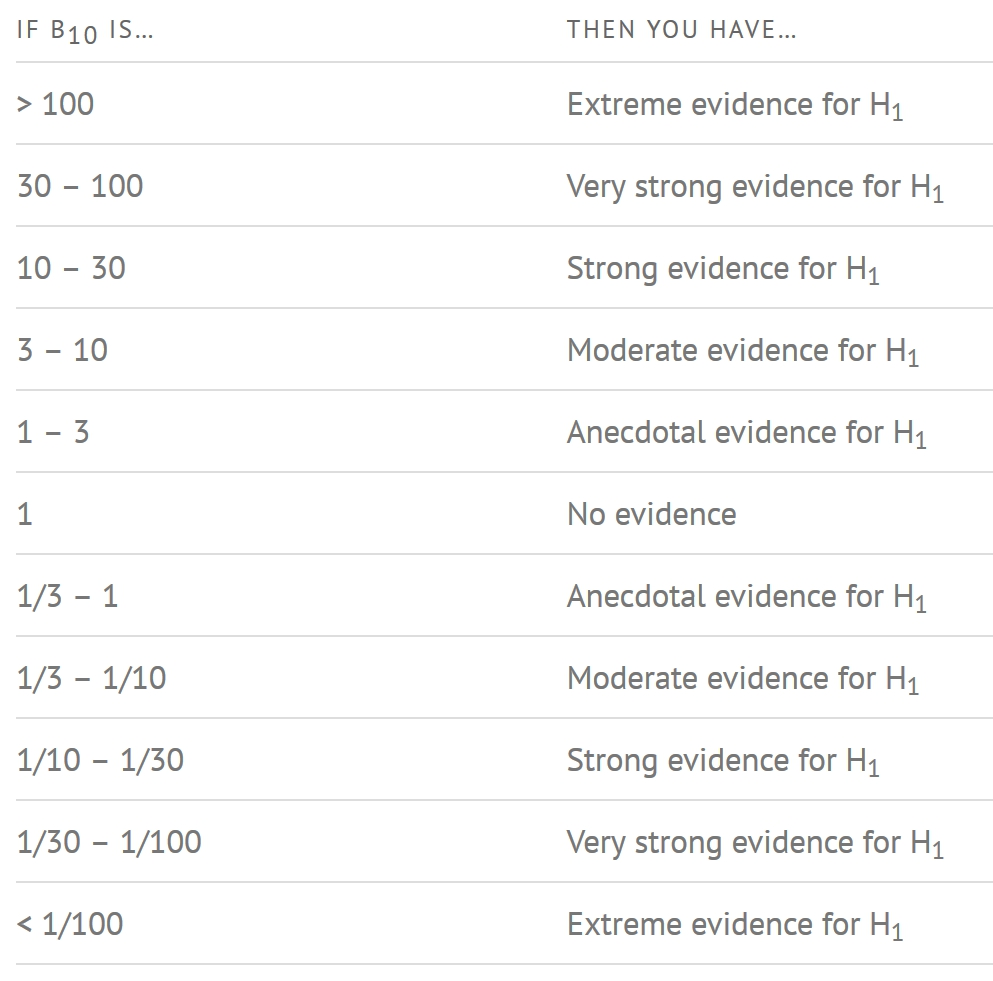
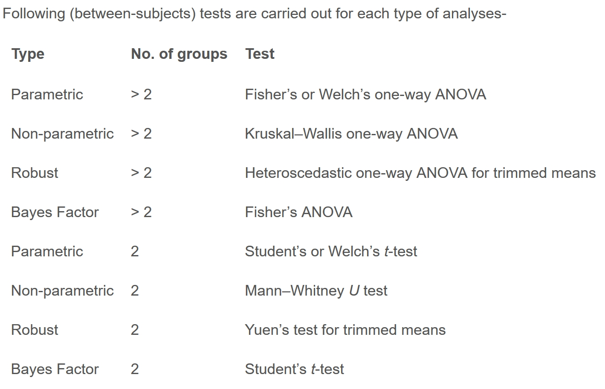

# Exercise 4B: Visual Statistical Analysis

# 1 Learning Outcome

In this hands-on exercise, I am to gain experience using:

-   ggstatsplot package to create visual graphics with rich statistical information,

-   performance package to visualise model diagnostics, and

-   parameters package to visualise model parameters

# Getting Started

ggstatsplot and tidyverse will be used

```{r}
pacman::p_load(ggstatsplot, tidyverse)
```

```{r}
install.packages("ggstatsplot")
```

## 2.1 Importing the data

```{r}
exam <- read_csv("data/Exam_data.csv")
```

# 3 One-sample test: `gghistostats()` method

In the code chunk below, [gghistostats()](https://www.indrapatil.com/ggstatsplot/reference/gghistostats.html) is used to to build an visual of one-sample test on English scores.

```{r}
set.seed(1234)

gghistostats(
  data = exam,
  x = ENGLISH,
  type = "bayes",
  test.value = 60,
  xlab = "English scores"
)
```

Default information: - statistical details - Bayes Factor - sample sizes - distribution summary

# 4 Unpacking the Bayes Factor

-   A Bayes factor is the ratio of the likelihood of one particular hypothesis to the likelihood of another. It can be interpreted as a measure of the strength of evidence in favor of one theory among two competing theories.

-   That’s because the Bayes factor gives us a way to evaluate the data in favor of a null hypothesis, and to use external information to do so. It tells us what the weight of the evidence is in favor of a given hypothesis.

-   When we are comparing two hypotheses, H1 (the alternate hypothesis) and H0 (the null hypothesis), the Bayes Factor is often written as B10. It can be defined mathematically as

    {width="332" height="58"}

-   The [Schwarz criterion](https://www.statisticshowto.com/bayesian-information-criterion/) is one of the easiest ways to calculate rough approximation of the Bayes Factor.

## 4.1 How to interpret Bayes Factor

A Bayes Factor can be any positive number. One of the most common interpretations is this one—first proposed by Harold Jeffereys (1961) and slightly modified by [Lee and Wagenmakers](chrome-extension://efaidnbmnnnibpcajpcglclefindmkaj/https://www-tandfonline-com.libproxy.smu.edu.sg/doi/pdf/10.1080/00031305.1999.10474443?needAccess=true) in 2013:

{width="465"}

# Two-sample mean test: `ggbetweenstats()`

In the code chunk below, [ggbetweenstats()](https://www.indrapatil.com/ggstatsplot/reference/ggbetweenstats.html) is used to build a visual for two-sample mean test of Maths scores by gender.

```{r}
ggbetweenstats(
  data = exam,
  x = GENDER, 
  y = MATHS,
  type = "np",
  messages = FALSE
)
```

## 5.1 Oneway ANOVA Test: `ggbetweenstats()`

In the code chunk below, [ggbetweenstats()](https://www.indrapatil.com/ggstatsplot/reference/ggbetweenstats.html) is used to build a visual for One-way ANOVA test on English score by race.

```{r}
ggbetweenstats(
  data = exam,
  x = RACE, 
  y = ENGLISH,
  type = "p",
  mean.ci = TRUE, 
  pairwise.comparisons = TRUE, 
  pairwise.display = "s",
  p.adjust.method = "fdr",
  messages = FALSE
)
```

-   “ns” → only non-significant

-   “s” → only significant

-   “all” → everything

## 5.2 Summary of tests - ggbetweenstats




# 6 Significant Test of Correlation: `ggscatterstats()`

```{r}
ggscatterstats(
  data = exam,
  x = MATHS,
  y = ENGLISH,
  marginal = FALSE,
  )
```

## 6.1 Significant Test of Association (Dependence)

In the code chunk below, the Maths scores is binned into a 4-class variable by using [cut()](https://www.rdocumentation.org/packages/base/versions/3.6.2/topics/cut).

```{r}
exam1 <- exam %>% 
  mutate(MATHS_bins = 
           cut(MATHS, 
               breaks = c(0,60,75,85,100))
)
```

In this code chunk below [ggbarstats()](https://www.indrapatil.com/ggstatsplot/reference/ggbarstats.html) is used to build a visual for Significant Test of Association.

```{r}
ggbarstats(exam1, 
           x = MATHS_bins, 
           y = GENDER)
```
