```{r}
#| label: pres-setup
#| results: hide
pacman::p_load(
  tidyverse, readr, ggdist, ggridges,
  ggstatsplot, ggpubr, patchwork,
  scales, viridis, knitr, kableExtra, plotly
)

insurance <- read_delim(
  "data/Dataset_of_motor_insurance_portfolio.csv",
  delim = ";", show_col_types = FALSE
) |>
  mutate(
    policy_type = factor(policy_type,
      levels = c("TP","TPG","CC","COMP_E","COMP_N"),
      labels = c("Third-Party","TP + Glass","Combined Cover",
                 "Comp. (Excess)","Comp. (No Excess)")),
    policy_status = factor(policy_status,
      levels = c("A","C"), labels = c("Active","Cancelled")),
    business_type = factor(business_type,
      levels = c("NB","P"), labels = c("New Business","Portfolio")),
    bonus_score = factor(bonus_score,
      levels = c("G","N","B"),
      labels = c("Good","Neutral","Bad"), ordered = TRUE),
    fuel_type = factor(fuel_type,
      levels = c("D","G"), labels = c("Diesel","Gasoline")),
    municipality_type = factor(municipality_type,
      levels = c("I","C","IS"), labels = c("Inland","Coastal","Islands")),
    circulation_area = factor(circulation_area,
      levels = c("U","R"), labels = c("Urban","Rural")),
    loss_ratio      = total_incurred / total_premium,
    claim_frequency = total_claims / total_exposure,
    claim_severity  = if_else(total_claims > 0,
                              total_incurred / total_claims, NA_real_),
    pure_premium    = total_incurred / total_exposure,
    years_licensed  = year - age_driving_licence,
    licence_age     = driver_age - years_licensed,
    driver_age_band = cut(driver_age, c(17,25,35,45,55,65,Inf),
      labels = c("18-25","26-35","36-45","46-55","56-65","65+"),
      right = TRUE, include.lowest = TRUE),
    vehicle_age_band = cut(vehicle_age,
      breaks = c(-Inf,3,7,12,18,25,Inf),
      labels = c("0-3","4-7","8-12","13-18","19-25","25+"), right = TRUE),
    brand_tier = case_when(
      vehicle_brand %in% c("BMW","MERCEDES","AUDI","LEXUS","PORSCHE",
        "JAGUAR","LAND ROVER","VOLVO","ALFA ROMEO") ~ "Luxury",
      vehicle_brand %in% c("VOLKSWAGEN","TOYOTA","FORD","OPEL","SEAT",
        "PEUGEOT","CITROEN","NISSAN","HYUNDAI","KIA",
        "FIAT","HONDA","MAZDA","SKODA","MITSUBISHI") ~ "Upper-mid",
      is.na(vehicle_brand) ~ NA_character_,
      TRUE ~ "Budget/Comm."),
    brand_tier = factor(brand_tier, levels = c("Luxury","Upper-mid","Budget/Comm.")),
    claim_breadth = rowSums(across(
      c(liability_claims,property_claims,theft_claims,
        fire_claims,glass_claims,legal_protection_claims,occupants_claims),
      \(x) x > 0)),
    had_glass_claim = glass_claims > 0
  )

lr_cap  <- quantile(insurance$loss_ratio,    0.99, na.rm = TRUE)
sev_cap <- quantile(insurance$claim_severity, 0.99, na.rm = TRUE)

insurance_viz <- insurance |>
  mutate(
    loss_ratio_capped = pmin(loss_ratio,    lr_cap),
    severity_capped   = pmin(claim_severity, sev_cap)
  )

bonus_pal <- c("Good" = "#27ae60", "Neutral" = "#e67e22", "Bad" = "#c0392b")

thm <- theme_minimal(base_size = 10) +
  theme(
    plot.title    = element_text(face = "bold", hjust = 0.5, size = 11),
    plot.subtitle = element_text(hjust = 0.5, colour = "grey40", size = 8.5),
    panel.grid.minor = element_blank(),
    legend.position  = "bottom",
    legend.text      = element_text(size = 8),
    legend.title     = element_text(size = 8)
  )
theme_set(thm)
```

------------------------------------------------------------------------

## Slide 1 \| Executive Summary

:::::: columns
:::: {.column width="55%"}
::: {style="font-size:0.82em; line-height:1.3;"}
A visual analytics investigation of **354,140 motor insurance policies** from a Spanish non-life insurer (2022–2024) uncovers structural profitability risks across product, customer, behavioural, and geographic dimensions.

**10 findings stand out for business attention:**

🔴 **Third-Party policies drive severe tail risks, while COMP_N policies suffer from high claim frequency**

🔴 **The Bonus Score functions as a frequency discriminator, not a severity discriminator**

🔴 **New Business risks are concentrated in severity, not frequency.** 

🔴 **Short-duration policies carry a systematically worse loss ratio distribution**

🔴 **Repair costs do not vary materially with vehicle age; avoid age-based severity loadings**
:::
::::

:::: {.column width="45%"}
::: {style="font-size:0.82em; line-height:1.3;"}
🔴 **High repair cost intensity identifies pricing blind spots in specific brands**

🔴 **Young drivers (18-25) are double-exposed; 65+ drivers show no meaningful deterioration**

🔴 **Young drivers paired with newer vehicles carry distinctively elevated claim rates.**

🔴 **Luxury vehicles are worse on both frequency and severity dimensions.**

🔴 **Natural attrition retains 75% of your worst risks.**

:::
::::
::::::

------------------------------------------------------------------------

## Slide 2 \| Methodology & Data

:::::::: columns
:::: {.column width="50%"}
::: {style="font-size:0.90em; line-height:1.35;"}
**Dataset**

354,140 motor insurance policies from a Spanish non-life insurer, 2022–2024. Covers 47 variables on policy type, driver and vehicle characteristics, premiums, and claims.

**How the analysis is structured**

-   [Data preparation and quality checks →](Take-home_Ex01.html#data-wrangling)
-   [KPIs derived for this analysis →](Take-home_Ex01.html#deriving-analytical-kpis)
-   [All univariate analyses →](Take-home_Ex01.html#univariate-analysis)
-   [All bivariate analyses →](Take-home_Ex01.html#bivariate-analysis-conventional-drivers)

Refer to details here: [link](https://isss-608-vaa-ten.vercel.app/Take-home_Ex/Take-home_Ex01/Take-home_Ex01#data-wrangling)

**Key data preparation steps**

-   Zero duplicates confirmed; four variables had minor missing data (under 0.5% each)
-   Missing values handled per-analysis, not globally — keeping decisions transparent
-   99th percentile cap applied to loss ratio and severity **for display only** — all analyses use full data
:::
::::

::::: {.column width="50%"}
:::: {style="font-size:0.90em; line-height:1.35;"}
**Six profitability metrics were derived**

| Metric          | What it measures                        |
|:----------------|:----------------------------------------|
| Loss ratio      | Profit/loss per €1 of premium collected |
| Claim frequency | Claims filed per policy year            |
| Claim severity  | Average repair cost per claim           |
| Pure premium    | Total risk cost per policy year         |

All metrics are **exposure-adjusted** so short- and full-year policies are compared on equal terms.

::: {style="font-size:0.90em; margin-top:8px; padding:5px 10px; background:#eaf3fb; border-left:3px solid #2980b9; border-radius:3px;"}
**Note on `age_driving_licence`:** This field records only 2 digits rather than a 4-digit year, making it unusable as a driving experience variable. It is excluded from all analyses.
:::
::::
:::::
::::::::

------------------------------------------------------------------------

## Slide 3 \| Analysis of Profitability and Loss Ratio by Policy Type

:::: columns
::: {.column width="52%"}

```{r}
#| echo: false
#| label: "Policy Profitability by Policy Type"
#| out-width: "100%"
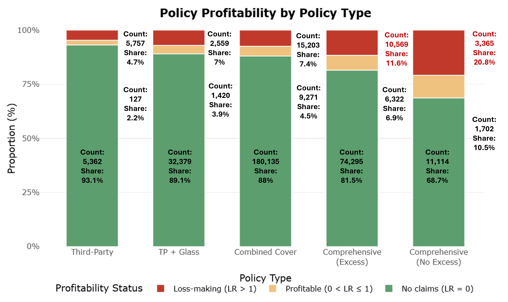
```
:::

::: {.column width="48%"}
```{r}
#| echo: false
#| label: "Loss Ratio by Policy Type"
#| out-width: "100%"
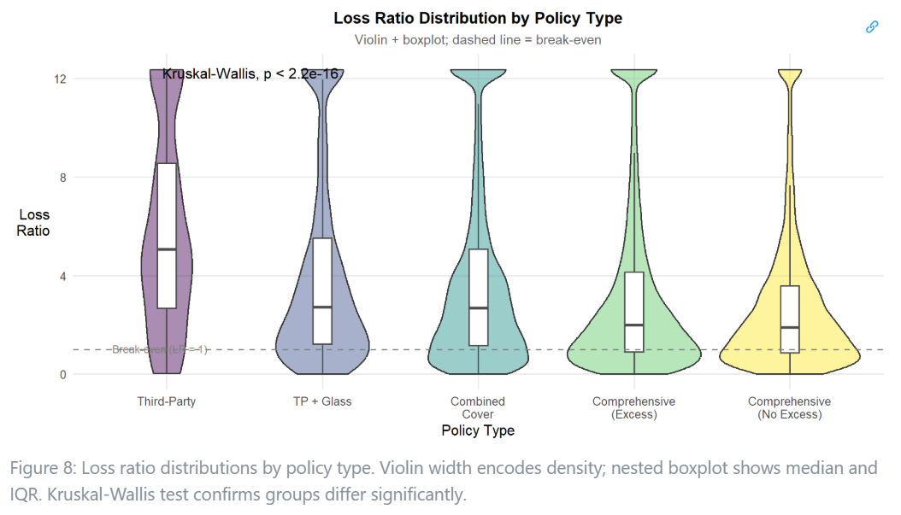
```
:::
::::

::: {style="font-size:0.8em; margin-top:4px; padding:5px 12px; background:#fef9e7; border-left:3px solid #c0392b; border-radius:3px;"}
**Finding 1 – Third-Party policies drive severe tail risks, while COMP_N policies suffer from high claim frequency.** Third-Party policies are the most profitable at the portfolio level (approximately 93% claim-free), but exhibit the highest median loss ratio among claimants (approximately LR = 5) and massive variability. Conversely, COMP_N (No Excess) has the lowest claim-free rate (\~70%) and the largest loss-making segment, though individual claims are less extreme relative to premiums collected.

-   Actionable: For Third-Party policies, ensure adequate reinsurance or capital reserves to handle catastrophic tail variance. For COMP_N, focus on frequency management by introducing mandatory deductibles to suppress the sheer volume of claiming policies.

-   Observed pattern: Third-Party premiums are low, so when claims occur, they are large relative to what was collected; COMP_N’s broader coverage attracts more claims, thinning out the profitable majority.

Refer to more details here:[link](https://isss-608-vaa-ten.vercel.app/Take-home_Ex/Take-home_Ex01/Take-home_Ex01#profitability-and-loss-ratio-by-policy-type)

:::

------------------------------------------------------------------------

## Slide 4 \| Analysis of Profitability and Loss Ratio by Bonus Score

:::: columns
::: {.column width="52%"}

```{r}
#| echo: false
#| label: "Policy Profitability by Bonus Score"
#| out-width: "100%"
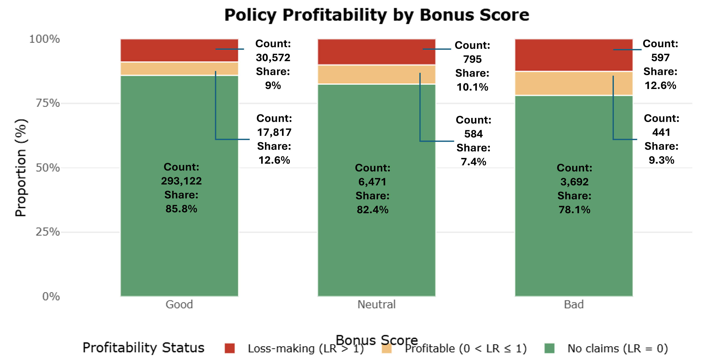
```
:::

::: {.column width="48%"}
```{r}
#| echo: false
#| label: "Loss Ratio by Bonus Score"
#| out-width: "100%"
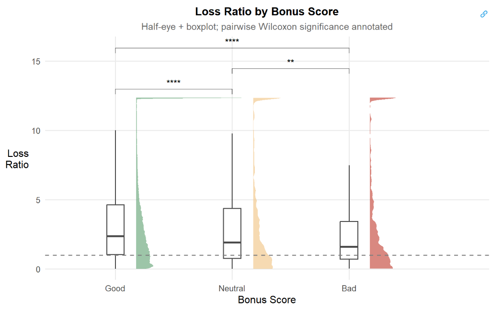
```
:::
::::

::: {style="font-size:0.8em; margin-top:4px; padding:5px 12px; background:#fef9e7; border-left:3px solid #c0392b; border-radius:3px;"}
**Finding 2 – The Bonus Score functions as a frequency discriminator, not a severity discriminator.** Good-score policies have the highest claim-free rate (~85%), but Good-score claimants show the highest median loss ratio (~2.5) and widest distribution. Bad-score claimants claim more often but show the lowest median LR (~1.5) because their premiums are already loaded for higher frequency.

-   Actionable: Relook at pricing approach in applying the bonus score to frequency models, but use vehicle value or policy type to model severity. Caution against over-correct severity for Bad-score policies or under-reserve for high-cost Good-score claims.

-   Observed pattern: Good claimants are rare but generate large losses (likely holding higher-value policies); Bad claimants are frequent but individual claims are less extreme relative to premium.

Refer to more details here:[link](https://isss-608-vaa-ten.vercel.app/Take-home_Ex/Take-home_Ex01/Take-home_Ex01#profitability-and-loss-ratio-by-bonus-score)

:::

------------------------------------------------------------------------

## Slide 5 \| Analysis of Profitability and Loss Ratio by Type of Business

:::: columns
::: {.column width="52%"}

```{r}
#| echo: false
#| label: "Policy Profitability by Business Type"
#| out-width: "100%"
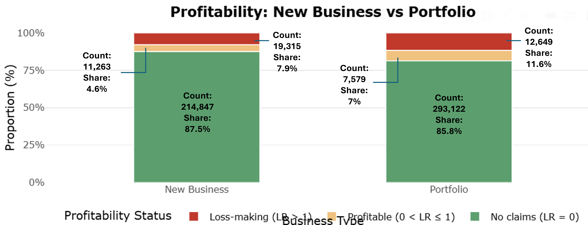
```
:::

::: {.column width="48%"}
```{r}
#| echo: false
#| label: "Loss Ratio by Business Type"
#| out-width: "100%"
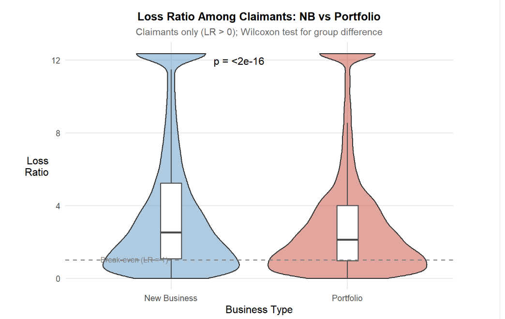
```
:::
::::

::: {style="font-size:0.8em; margin-top:4px; padding:5px 12px; background:#fef9e7; border-left:3px solid #c0392b; border-radius:3px;"}
**Finding 3 – New Business risks are concentrated in severity, not frequency.** New Business policies have a higher claim-free rate (~88%) than Portfolio renewals (~82%). However, New Business claimants produce a higher median loss ratio (~2.5 vs 2.0) with heavier tail risk extending beyond LR = 8.

-   Actionable: Consider specific severity loading at acquisition for New Business to account for the heavier tail risk that the renewal book’s underwriting filters have already screened out.

-   Observed pattern: The acquisition channel absorbs policyholders whose individual claim events produce higher costs.

Refer to more details here:[link](https://isss-608-vaa-ten.vercel.app/Take-home_Ex/Take-home_Ex01/Take-home_Ex01#new-business-vs-portfolio-who-is-the-worse-risk-and-why)

:::

------------------------------------------------------------------------

## Slide 6 \| Analysis of Profitability and Loss Ratio by Policy Duration

```{r}
#| echo: false
#| label: "Loss Ratio By Duration Exposure"
#| fig-align: "center"
#| out-width: "85%"
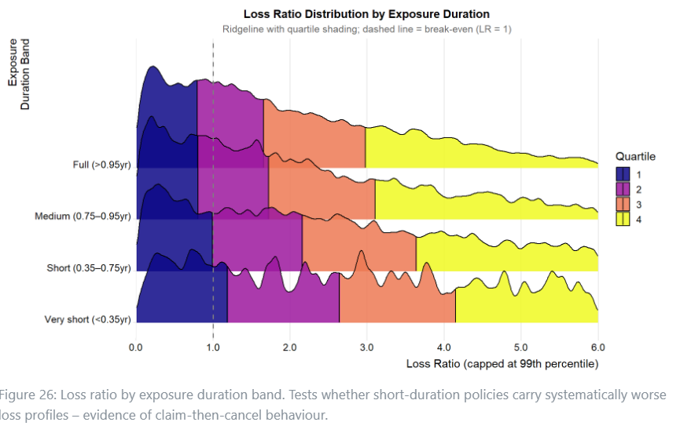
```

::: {style="font-size:0.7em; margin-top:4px; padding:5px 12px; background:#fef9e7; border-left:3px solid #c0392b; border-radius:3px;"}
**Finding 4 – Short-duration policies carry a systematically worse loss ratio distribution.** Policies held for very short (<0.35yr) and short (0.35–0.75yr) durations show higher median loss ratios and heavier right tails than full-year (>0.95yr) policies.

-   Actionable: Consider to apply upfront premium loadings or short-rate cancellation penalties to protect against early-term risk and potential "claim-then-cancel" behavior.

-   Observed pattern: The median loss ratio for short-duration policies sits to the right of the full-duration median, confirming they are systematically less profitable.

Refer to more details here:[link](https://isss-608-vaa-ten.vercel.app/Take-home_Ex/Take-home_Ex01/Take-home_Ex01#exposure-duration-as-a-hidden-quality-signal)

:::

------------------------------------------------------------------------


## Slide 7 \| Analysis of Repair Cost Against Vehicle Age

:::: columns
::: {.column width="52%"}

```{r}
#| echo: false
#| label: "Vehicle Age Distribution"
#| out-width: "100%"
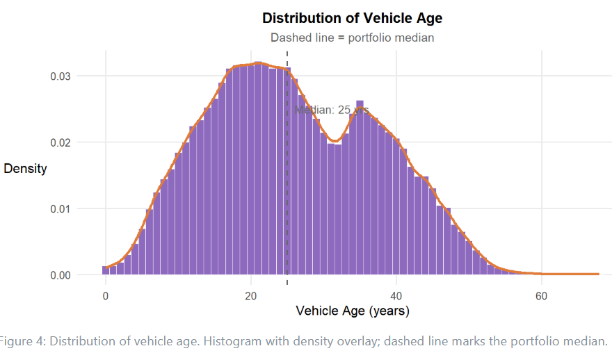
```
:::

::: {.column width="48%"}
```{r}
#| echo: false
#| label: "Claim Severity vs Vehicle Age"
#| out-width: "100%"
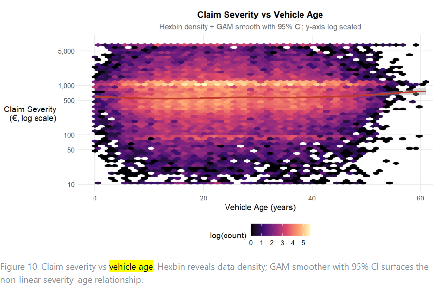
```

:::
::::

::: {style="font-size:0.8em; margin-top:4px; padding:5px 12px; background:#fef9e7; border-left:3px solid #c0392b; border-radius:3px;"}
**Finding 5 – Repair costs do not vary materially with vehicle age; avoid age-based severity loadings.** The severity trend is broadly flat across the 5–50 year vehicle age range (concentrated at €500–€700).

-   Actionable: Caution against using vehicle age alone as a severity predictor; it adds rating complexity without meaningfully improving risk differentiation.

-   Observed pattern: The distribution is right-skewed with a mode around 20–25 years. The long tail of very old vehicles (>40 years) represents a small segment likely insured under basic third-party cover where comprehensive replacement value is not relevant. Hexbin density confirms the vast majority of claims concentrate in a flat band regardless of vehicle age.

Refer to more details here:[link](https://isss-608-vaa-ten.vercel.app/Take-home_Ex/Take-home_Ex01/Take-home_Ex01#claim-severity-by-vehicle-age)

:::

------------------------------------------------------------------------

## Slide 8 \| Analysis of Repair Cost Intensity Against Car Brand


```{r}
#| echo: false
#| label: "Repair Cost Intenstiy by Vehicle Brand"
#| fig-align: "center"
#| out-width: "85%"
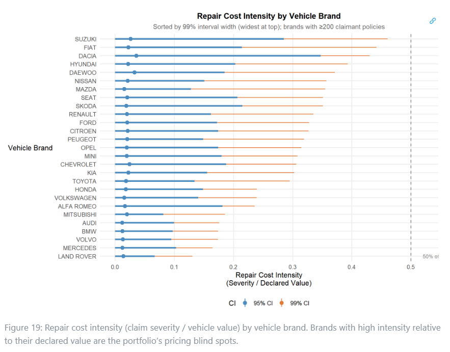
```

::: {style="font-size:0.7em; margin-top:4px; padding:5px 12px; background:#fef9e7; border-left:3px solid #c0392b; border-radius:3px;"}
**Finding 6 – High repair cost intensity identifies pricing blind spots in specific brands.** Certain brands systematically generate repair costs that consume more than half of the declared vehicle value per incident.

-   Actionable: Consider applying a brand-specific severity surcharge to these vehicles.

-   Observed pattern: These premiums are calibrated to heavily depreciated declared values, but retain expensive parts and specialist labor requirements.

Refer to more details here:[link](https://isss-608-vaa-ten.vercel.app/Take-home_Ex/Take-home_Ex01/Take-home_Ex01#which-brands-are-most-expensive-to-repair-relative-to-declared-value)

::: 

------------------------------------------------------------------------

## Slide 9 \| Analysis of Profitability and Loss Ratio by Age Bands

:::: columns
::: {.column width="52%"}

```{r}
#| echo: false
#| label: "Policy Profitability by Driver Age Band"
#| out-width: "100%"
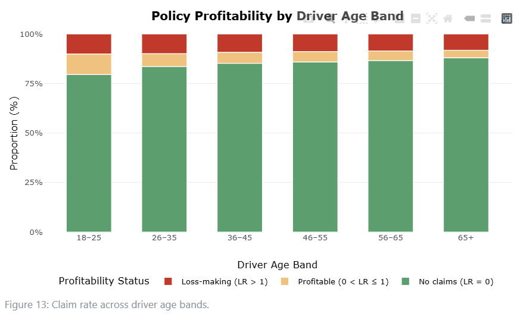
```
:::

::: {.column width="48%"}

```{r}
#| echo: false
#| label: "Loss Ratio vs Driver Age Band"
#| out-width: "100%"
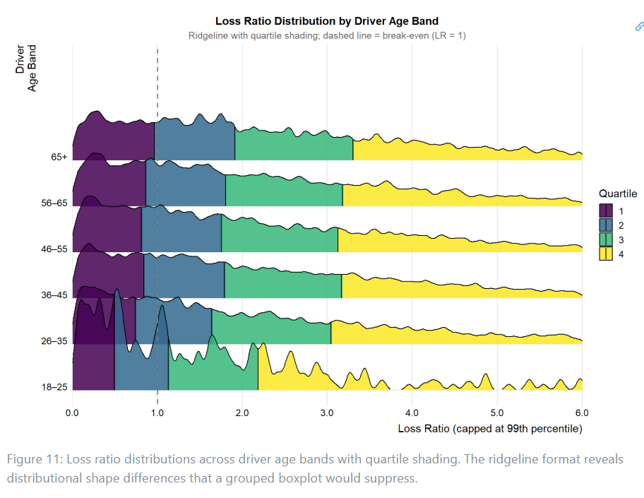
```
:::
::::

::: {style="font-size:0.8em; margin-top:4px; padding:5px 12px; background:#fef9e7; border-left:3px solid #c0392b; border-radius:3px;"}
**Finding 7 – Young drivers (18-25) are double-exposed; 65+ drivers show no meaningful deterioration.** The 18–25 band has the lowest claim-free rate (~80%) and the fewest low-loss-ratio claimants. Conversely, the 65+ band is comparable in shape to the 56–65 group, showing no visible deterioration.

-   Actionable: Consider applying age-based pricing loadings to the 18–25 segment. Do not apply age-based surcharges to 65+ drivers without further evidence. Use the 36–55 band as your baseline anchor.

-   Observed pattern: Young drivers claim more often and produce worse outcomes when they do; senior drivers remain stable.

Refer to more details here:[link](https://isss-608-vaa-ten.vercel.app/Take-home_Ex/Take-home_Ex01/Take-home_Ex01#profitability-and-loss-ratio-distributions-across-driver-age-bands)

:::

------------------------------------------------------------------------

## Slide 10 \| Cross Analysis of Claim Frequency Against Age and Vehicle Age

```{r}
#| echo: false
#| label: "Claim Frequency: Driver Age x Vehicle Age Interaction"
#| fig-align: "center"
#| out-width: "85%"
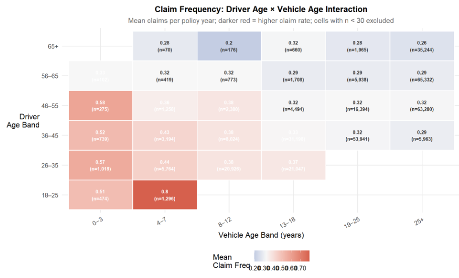
```

::: {style="font-size:0.7em; margin-top:4px; padding:5px 12px; background:#fef9e7; border-left:3px solid #c0392b; border-radius:3px;"}
**Finding 8 – Young drivers paired with newer vehicles carry distinctively elevated claim rates.** The combination of 18-25 year-olds driving 4–7 year-old vehicles produces the highest mean claim frequency in the portfolio (0.80).

-   Actionable: Consider implementing an interaction factor in pricing models specifically for young drivers operating newer vehicles (0-7 years old).

-   Observed pattern: Across middle bands (26-55), newer vehicles also claim more frequently, but the young-driver/new-vehicle interaction is uniquely extreme.

Refer to more details here:[link](https://isss-608-vaa-ten.vercel.app/Take-home_Ex/Take-home_Ex01/Take-home_Ex01#older-driver-young-car-interaction)

:::


------------------------------------------------------------------------

## Slide 11 \| Analysis of Claim Frequency and Severity by Brand

```{r}
#| echo: false
#| label: "Brand Tier: Frequency vs Claim Severity"
#| fig-align: "center"
#| out-width: "85%"
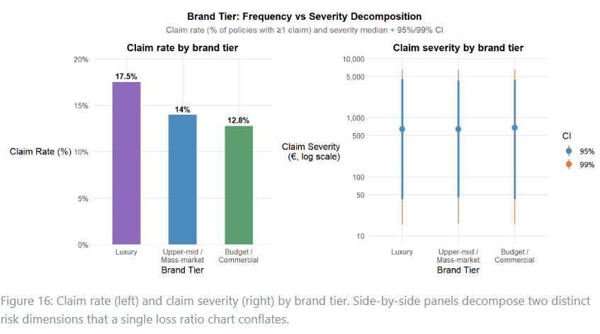
```

::: {style="font-size:0.7em; margin-top:4px; padding:5px 12px; background:#fef9e7; border-left:3px solid #c0392b; border-radius:3px;"}
**Finding 9 – Luxury vehicles are worse on both frequency and severity dimensions.** Luxury vehicles have the highest claim rate (17.5% vs 12.8% for Budget) and their 99% CI extends further, indicating disproportionately costly extreme claims.

-   Actionable: Consider to relook at potential for frequency loading to Luxury policies to reflect higher claim rates, plus a separate severity tail loading to reserve for catastrophic exposures.

-   Observed pattern: Reverses the "prestige paradox"; luxury drivers claim more often and carry heavier tail risk.

Refer to more details here:[link](https://isss-608-vaa-ten.vercel.app/Take-home_Ex/Take-home_Ex01/Take-home_Ex01#do-prestige-brand-drivers-make-fewer-claims-or-just-different-ones)

:::

------------------------------------------------------------------------

## Slide 12 \| Analysis of Cancellation Rates and Comparison of Active vs Cancelled Loss Ratios

:::: columns
::: {.column width="52%"}

```{r}
#| echo: false
#| label: "Cancellation Rate by Bonus Score"
#| out-width: "85%"
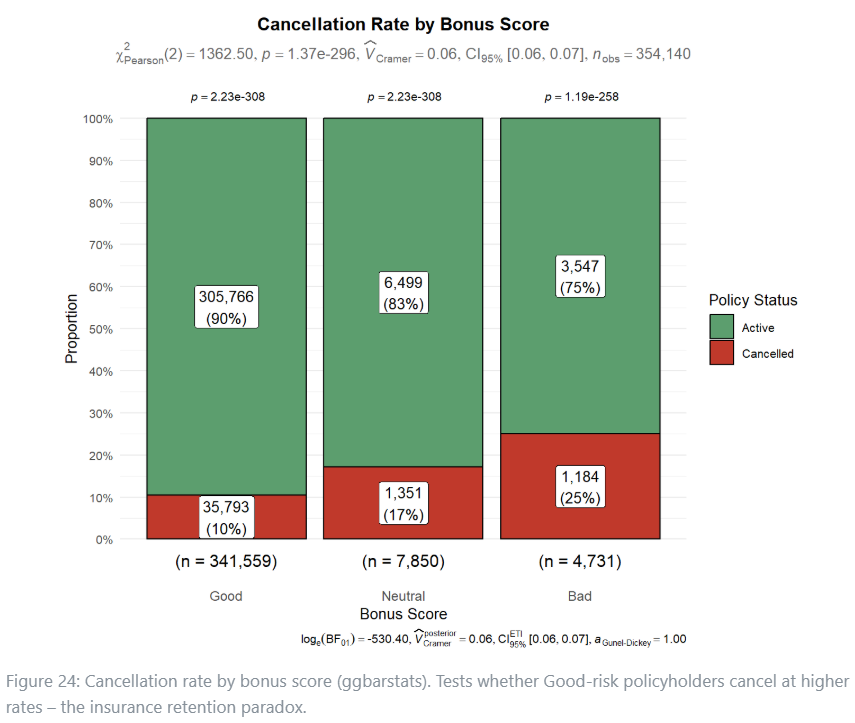
```
:::

::: {.column width="48%"}

```{r}
#| echo: false
#| label: "Loss Ratio Distribution: Active vs Cancelled by Bonus Score"
#| out-width: "100%"
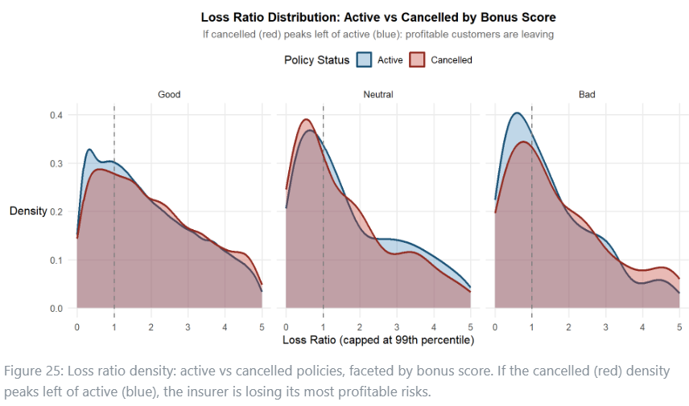
```
:::
::::

::: {style="font-size:0.75em; margin-top:4px; padding:5px 12px; background:#fef9e7; border-left:3px solid #c0392b; border-radius:3px;"}
**Finding 10 – Natural attrition retains 75% of your worst risks. ** While Bad-score policies cancel at the highest rate (25%), 75% remain active. Furthermore, departing Good-score customers do not systematically represent the most profitable ones.

-   Actionable: Consider relook at pricing for Bad-score renewals to actively restructure coverage or force non-renewal. Do not rely on natural attrition to clean the portfolio.

-   Observed pattern: Poor-quality risks are highly sticky because they struggle to find competitive alternatives elsewhere.

Refer to more details here:[link](https://isss-608-vaa-ten.vercel.app/Take-home_Ex/Take-home_Ex01/Take-home_Ex01#do-profitable-customers-cancel-more-often)

:::

------------------------------------------------------------------------

## Slide 13 \| Conclusion & Reflection

::::::: columns
:::: {.column width="52%"}
::: {style="font-size:0.75em; line-height:1.35;"}
**What this exercise demonstrates**

Visual analytics combined with statistical rigour, provides structured, evidence-based insights. Distributional visualisation, non-parametric testing, and explicit uncertainty quantification reveal patterns that summary statistics alone miss.

**Data Limitations**

-   `years_licensed` mis-specified; re-derivation needed

-   Cross-sectional data; no causal inference

**Further work required**

🔬 Re-derive `years_licensed` as genuine experience years and retest as risk predictor

🔬 For Third-Party policies, ensure adequate reinsurance or capital reserves to handle catastrophic tail variance. For COMP_N, focus on frequency management by potentially introducing mandatory deductibles to suppress the sheer volume of claiming policies.

🔬 Relook at pricing approach in applying the bonus score to frequency models, but use vehicle value or policy type to model severity. Caution against over-correct severity for Bad-score policies or under-reserve for high-cost Good-score claims.

:::
::::

:::: {.column width="48%"}
::: {style="font-size:0.75em; line-height:1.35;"}
**Further work required**

🔬 Consider specific severity loading at acquisition for New Business to account for the heavier tail risk that the renewal book’s underwriting filters have already screened out.

🔬 Consider to apply upfront premium loadings or short-rate cancellation penalties to protect against early-term risk and potential "claim-then-cancel" behavior.

🔬 Caution against using vehicle age alone as a severity predictor; it adds rating complexity without meaningfully improving risk differentiation.

🔬 Consider applying a brand-specific severity surcharge to these vehicles.

🔬 Consider applying age-based pricing loadings to the 18–25 segment.

🔬 Consider implementing an interaction factor in pricing models specifically for young drivers operating newer vehicles (0-7 years old).

🔬 Consider relooking at potential for frequency loading to Luxury policies to reflect higher claim rates, plus a separate severity tail loading to reserve for catastrophic exposures.

🔬 Consider relook at pricing for Bad-score renewals to actively restructure coverage or force non-renewal. Do not rely on natural attrition to clean the portfolio.

:::
::::
:::::::
