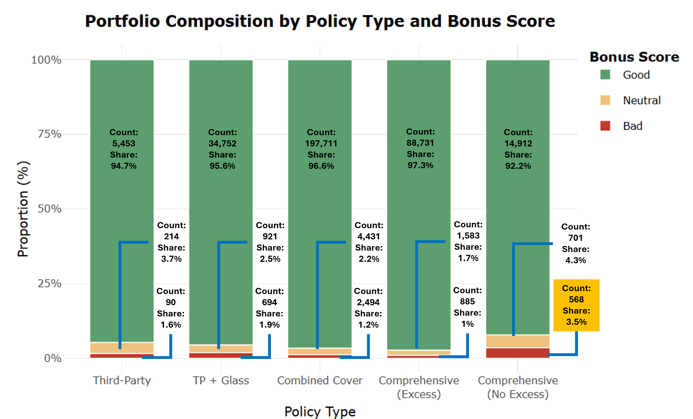
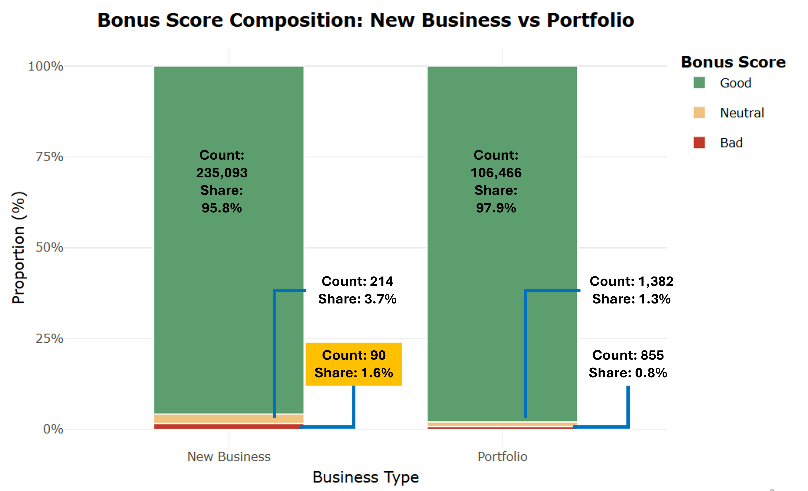

```{r}
#| label: pres-setup
#| results: hide
pacman::p_load(
  tidyverse, readr, ggdist, ggridges,
  ggstatsplot, ggpubr, patchwork,
  scales, viridis, knitr, kableExtra, plotly
)

insurance <- read_delim(
  "data/Dataset_of_motor_insurance_portfolio.csv",
  delim = ";", show_col_types = FALSE
) |>
  mutate(
    policy_type = factor(policy_type,
      levels = c("TP","TPG","CC","COMP_E","COMP_N"),
      labels = c("Third-Party","TP + Glass","Combined Cover",
                 "Comp. (Excess)","Comp. (No Excess)")),
    policy_status = factor(policy_status,
      levels = c("A","C"), labels = c("Active","Cancelled")),
    business_type = factor(business_type,
      levels = c("NB","P"), labels = c("New Business","Portfolio")),
    bonus_score = factor(bonus_score,
      levels = c("G","N","B"),
      labels = c("Good","Neutral","Bad"), ordered = TRUE),
    fuel_type = factor(fuel_type,
      levels = c("D","G"), labels = c("Diesel","Gasoline")),
    municipality_type = factor(municipality_type,
      levels = c("I","C","IS"), labels = c("Inland","Coastal","Islands")),
    circulation_area = factor(circulation_area,
      levels = c("U","R"), labels = c("Urban","Rural")),
    loss_ratio      = total_incurred / total_premium,
    claim_frequency = total_claims / total_exposure,
    claim_severity  = if_else(total_claims > 0,
                              total_incurred / total_claims, NA_real_),
    pure_premium    = total_incurred / total_exposure,
    years_licensed  = year - age_driving_licence,
    licence_age     = driver_age - years_licensed,
    driver_age_band = cut(driver_age, c(17,25,35,45,55,65,Inf),
      labels = c("18-25","26-35","36-45","46-55","56-65","65+"),
      right = TRUE, include.lowest = TRUE),
    vehicle_age_band = cut(vehicle_age,
      breaks = c(-Inf,3,7,12,18,25,Inf),
      labels = c("0-3","4-7","8-12","13-18","19-25","25+"), right = TRUE),
    brand_tier = case_when(
      vehicle_brand %in% c("BMW","MERCEDES","AUDI","LEXUS","PORSCHE",
        "JAGUAR","LAND ROVER","VOLVO","ALFA ROMEO") ~ "Luxury",
      vehicle_brand %in% c("VOLKSWAGEN","TOYOTA","FORD","OPEL","SEAT",
        "PEUGEOT","CITROEN","NISSAN","HYUNDAI","KIA",
        "FIAT","HONDA","MAZDA","SKODA","MITSUBISHI") ~ "Upper-mid",
      is.na(vehicle_brand) ~ NA_character_,
      TRUE ~ "Budget/Comm."),
    brand_tier = factor(brand_tier, levels = c("Luxury","Upper-mid","Budget/Comm.")),
    claim_breadth = rowSums(across(
      c(liability_claims,property_claims,theft_claims,
        fire_claims,glass_claims,legal_protection_claims,occupants_claims),
      \(x) x > 0)),
    had_glass_claim = glass_claims > 0
  )

lr_cap  <- quantile(insurance$loss_ratio,    0.99, na.rm = TRUE)
sev_cap <- quantile(insurance$claim_severity, 0.99, na.rm = TRUE)

insurance_viz <- insurance |>
  mutate(
    loss_ratio_capped = pmin(loss_ratio,    lr_cap),
    severity_capped   = pmin(claim_severity, sev_cap)
  )

bonus_pal <- c("Good" = "#27ae60", "Neutral" = "#e67e22", "Bad" = "#c0392b")

thm <- theme_minimal(base_size = 10) +
  theme(
    plot.title    = element_text(face = "bold", hjust = 0.5, size = 11),
    plot.subtitle = element_text(hjust = 0.5, colour = "grey40", size = 8.5),
    panel.grid.minor = element_blank(),
    legend.position  = "bottom",
    legend.text      = element_text(size = 8),
    legend.title     = element_text(size = 8)
  )
theme_set(thm)
```

---

## Slide 1 | Executive Summary

::::::: columns
::::: {.column width="55%"}
::: {style="font-size:0.82em; line-height:1.3;"}
A visual analytics investigation of **354,140 motor insurance policies** from a Spanish non-life insurer (2022–2024) uncovers structural profitability risks across product, customer, behavioural, and geographic dimensions.

**Four findings stand out for business attention:**

🔴 **Comprehensive cover (no excess)** attracts three times more poor-risk drivers than basic third-party cover — its pricing may not reflect the risk it is absorbing

🔴 **Poor claims history policyholders are the stickiest** — 75% remain active year after year, making them the hardest-to-shed risk concentration in the portfolio

🟠 **Short-duration policies consistently generate higher losses** relative to the premium collected — a pattern consistent with claims being filed shortly before policies are cancelled

🟠 **Policyholders who file glass claims almost always have other claims too** — glass claim history is a reliable early warning signal of broader claims activity
:::

::: {style="font-size:0.82em; margin-top:4px; padding:4px 10px; background:#fef9e7; border-left:3px solid #e67e22; border-radius:3px;"}
Further patterns: newly acquired customers carry twice the adverse risk of renewals · urban policies generate higher losses than rural
:::
:::::

::: {.column width="45%"}
```{r}
#| label: exec-summary-chart
#| fig-height: 4.2
#| fig-width: 5

summary_df <- tibble(
  finding = c(
    "COMP_N: Bad-risk
policyholder rate",
    "Third-Party: Bad-risk
policyholder rate",
    "Bad-score: retention
rate (stay active)",
    "Good-score: retention
rate (stay active)"
  ),
  value   = c(3.5, 1.2, 75, 90),
  group   = c("Product risk","Product risk","Retention","Retention"),
  label   = c("3.5%","1.2%","75%","90%")
) |>
  mutate(finding = fct_inorder(finding))

ggplot(summary_df, aes(x = fct_rev(finding), y = value, fill = group)) +
  geom_col(width = 0.65, show.legend = TRUE) +
  geom_text(aes(label = label), hjust = -0.15, size = 3.2, fontface = "bold") +
  scale_fill_manual(
    values = c("Product risk" = "#c0392b", "Retention" = "#2980b9"),
    name = NULL
  ) +
  scale_y_continuous(limits = c(0, 105),
                     labels = function(x) paste0(x, "%")) +
  coord_flip() +
  labs(title = "Key Risk Signals at a Glance",
       subtitle = "Two dimensions: adverse selection and retention risk",
       x = NULL, y = "% value") +
  theme(legend.position = "top",
        plot.background = element_rect(fill = "white", colour = NA),
        axis.text.y = element_text(size = 8.5))
```
:::
:::::::

---

## Slide 2 | Methodology & Data

::: columns
::: {.column width="50%"}
::: {style="font-size:0.90em; line-height:1.35;"}
**Dataset**

354,140 motor insurance policies from a Spanish non-life insurer, 2022–2024. Covers 47 variables on policy type, driver and vehicle characteristics, premiums, and claims.

**How the analysis is structured**

- [Data preparation and quality checks →](Take-home_Ex01.html#data-wrangling)
- [KPIs derived for this analysis →](Take-home_Ex01.html#deriving-analytical-kpis)
- [All univariate analyses →](Take-home_Ex01.html#univariate-analysis)
- [All bivariate analyses →](Take-home_Ex01.html#bivariate-analysis-conventional-drivers)

**Key data preparation steps**

- Zero duplicates confirmed; four variables had minor missing data (under 0.5% each)
- Missing values handled per-analysis, not globally — keeping decisions transparent
- 99th percentile cap applied to loss ratio and severity **for display only** — all analyses use full data
:::
:::
::: {.column width="50%"}
::: {style="font-size:0.90em; line-height:1.35;"}
**Six profitability metrics were derived**

| Metric | What it measures |
|:--|:--|
| Loss ratio | Profit/loss per €1 of premium collected |
| Claim frequency | Claims filed per policy year |
| Claim severity | Average repair cost per claim |
| Pure premium | Total risk cost per policy year |

All metrics are **exposure-adjusted** so short- and full-year policies are compared on equal terms.

::: {style="font-size:0.90em; margin-top:8px; padding:5px 10px; background:#eaf3fb; border-left:3px solid #2980b9; border-radius:3px;"}
**Note on `age_driving_licence`:** This field records only 2 digits rather than a 4-digit year, making it unusable as a driving experience variable. It is excluded from all analyses.
:::
:::
:::
:::

---

## Slide 3a | Univariate: Bonus Score by Policy Type

```{r}
#| echo: false
#| label: slide6-policy-type
#| out-width: "100%"

```

::: {style="font-size:0.91em; margin-top:4px; padding:5px 12px; background:#fef9e7; border-left:3px solid #c0392b; border-radius:3px;"}
**What this tells the business:** Comprehensive cover without excess (COMP_N) carries 3.5% Bad-score policyholders — nearly three times the rate of basic third-party cover. Higher-risk drivers are disproportionately self-selecting into the most protective product, which raises questions about whether its current premiums reflect the risk being absorbed.
:::

---

## Slide 3b | Univariate: Bonus Score by Business Type

```{r}
#| echo: false
#| label: slide6-bonus-business
#| out-width: "100%"

```

::: {style="font-size:0.91em; margin-top:4px; padding:5px 12px; background:#fef9e7; border-left:3px solid #c0392b; border-radius:3px;"}
**What this tells the business:** Newly acquired customers carry twice the proportion of poor claims history drivers compared to existing portfolio renewals (1.6% Bad vs 0.8%). The acquisition channel absorbs materially worse risk before renewal underwriting filters can apply — a structural gap that the current pricing may not fully account for.
:::

---

## Slide 4 | Univariate: Geographic & Vehicle Distributions

::::: columns
::: {.column width="34%"}
```{r}
#| label: slide7-geo
#| fig-height: 3.7
#| fig-width: 3.4
geo_df <- insurance_viz |>
  count(municipality_type, circulation_area) |>
  group_by(municipality_type) |>
  mutate(pct = n / sum(n) * 100, n_total = sum(n)) |>
  ungroup()

ggplot(geo_df,
       aes(x = municipality_type, y = pct, fill = circulation_area)) +
  geom_col(position = "stack", width = 0.6, colour = "white") +
  geom_text(aes(label = paste0(round(pct,0),"%\n(n=",comma(n),")")),
            position = position_stack(vjust = 0.5),
            size = 2.3, colour = "white", fontface = "bold") +
  geom_text(data = distinct(geo_df, municipality_type, n_total),
            aes(x = municipality_type, y = 107,
                label = paste0("n=",comma(n_total))),
            inherit.aes = FALSE, size = 2.4, colour = "grey30") +
  scale_fill_manual(values = c("Urban"="#2980b9","Rural"="#8e44ad"), name = NULL) +
  scale_y_continuous(limits = c(0,115), labels = function(x) paste0(x,"%")) +
  labs(title = "Geographic Split",
       x = NULL, y = "%") +
  theme(legend.position = "top")
```
:::

::: {.column width="66%"}
```{r}
#| label: slide7-vehicle-dist
#| fig-height: 3.7
#| fig-width: 6.2
p_vage <- ggplot(insurance_viz |> filter(!is.na(vehicle_age)),
                 aes(x = vehicle_age)) +
  geom_histogram(aes(y = after_stat(density)), binwidth = 1,
                 fill = "#8e44ad", colour = "white", linewidth = 0.15) +
  geom_density(colour = "#e67e22", linewidth = 0.9) +
  geom_vline(xintercept = median(insurance_viz$vehicle_age, na.rm=TRUE),
             linetype = "dashed", colour = "grey40") +
  annotate("text",
           x = median(insurance_viz$vehicle_age, na.rm=TRUE)+1.5, y=0.022,
           label = paste0("Med ",
             round(median(insurance_viz$vehicle_age, na.rm=TRUE),0),"yr"),
           hjust = 0, size = 2.6, colour = "grey40") +
  labs(title = "Vehicle Age", x = "Years", y = "Density")

p_vval <- ggplot(insurance_viz |> filter(!is.na(vehicle_value)),
                 aes(x = vehicle_value)) +
  geom_histogram(aes(y = after_stat(density)), bins = 60,
                 fill = "#2980b9", colour = "white", linewidth = 0.15) +
  geom_density(colour = "#c0392b", linewidth = 0.9) +
  scale_x_log10(labels = comma) +
  labs(title = "Vehicle Value (log₁₀)", x = "EUR", y = "Density")

p_vage + p_vval
```
:::
:::::

::: {style="font-size:0.91em; margin-top:4px; padding:5px 12px; background:#eaf4fc; border-left:3px solid #2980b9; border-radius:3px;"}
**What this tells the business:** The island segment, while comprising around 24,000 policies, shows much wider uncertainty bands in the loss ratio analysis (Slide 14) than other segments — reflecting greater variability in loss outcomes within that segment. Its observed loss ratio should be treated as a range estimate, not a reliable figure for pricing. Most insured vehicles are 20–25 years old on average, and the typical vehicle is worth approximately €24,700.
:::

---

## Slide 5 | Univariate: Driver Age Distribution

:::::: columns
::: {.column width="56%"}
```{r}
#| label: slide8-driver-age
#| fig-height: 3.9
#| fig-width: 5.6
med_age <- median(insurance_viz$driver_age, na.rm=TRUE)

ggplot(insurance_viz, aes(x = driver_age)) +
  geom_histogram(aes(y = after_stat(density)), binwidth = 2,
                 fill = "#27ae60", colour = "white", linewidth = 0.2) +
  geom_density(colour = "#c0392b", linewidth = 1.1) +
  geom_vline(xintercept = c(25, 65), linetype = "dashed",
             colour = "#2c3e50", linewidth = 0.8) +
  annotate("rect", xmin=17, xmax=25, ymin=0, ymax=0.043, alpha=0.08, fill="#e74c3c") +
  annotate("rect", xmin=65, xmax=90, ymin=0, ymax=0.043, alpha=0.08, fill="#e74c3c") +
  annotate("text", x=21, y=0.040, label="Young\nrisk\nzone",
           size=2.6, colour="#c0392b", hjust=0.5) +
  annotate("text", x=73, y=0.040, label="Senior\nrisk\nzone",
           size=2.6, colour="#c0392b", hjust=0.5) +
  annotate("text", x=26, y=0.030, label="25", size=2.8, colour="#2c3e50") +
  annotate("text", x=66, y=0.030, label="65", size=2.8, colour="#2c3e50") +
  geom_vline(xintercept=med_age, linetype="dotted", colour="#2980b9", linewidth=0.8) +
  annotate("text", x=med_age+1.5, y=0.025,
           label=paste0("Median: ",round(med_age,0)),
           size=2.8, colour="#2980b9", hjust=0) +
  scale_x_continuous(breaks=seq(20,90,10)) +
  labs(title="Distribution of Driver Age",
       subtitle="Shaded zones = actuarial high-risk segments (under 25 and over 65)",
       x="Driver Age (years)", y="Density")
```
:::

:::: {.column width="44%"}
::: {style="font-size:0.80em; line-height:1.35;"}
The portfolio peaks between **38-42 years** with a median of **48**, and is concentrated in the **30-60 band**. The distribution is moderately right-skewed, rising steeply from age 20 and tapering gradually through the 70s.

**Young risk zone (under 25):** Histogram bars are sparse and short, confirming this group is a minor fraction of total policies. Prior research associates this segment with elevated claim rates due to limited experience and higher risk-taking behaviour (Meng et al., 2022; ABI, 2009).

**Senior risk zone (over 65):** Unlike the sharp drop on the left, the right tail declines gradually. Bars at 65–75 remain visible before tapering toward 90. Prior research links increased crash risk beyond 65 to declining physical capacity (Cappelletti, 2023).

**What this tells the business:** The portfolio is dominated by middle-aged drivers (30–60 years) — the lowest-risk group. Very young and older drivers are present but thin in volume. Because they represent such a small share of policies, their higher-risk characteristics do not show up clearly in portfolio-wide statistics. Their risk differences are visible when examining each age group's loss pattern directly in Slide 12.
:::
::::
::::::

---

## Slide 6 | Univariate: Summary of Findings

::::::: columns
::::: {.column width="95%"}
::: {style="font-size:0.95em;"}
| Variable | Pattern | Implication |
|:-----------------------|:-----------------------|:-----------------------|
| **Policy type** | COMP_N: 3.5% Bad; TP: 1.6% | Adverse selection in comp. cover |
| **Business type** | NB: 1.6% Bad vs 0.8% Portfolio | Acquisition absorbs worse risk |
| **Municipality** | Islands: high loss variability | Wide uncertainty bands — treat observed loss ratio as a range, not a fixed figure |
| **Vehicle age** | Mode 20–25 yrs; right-skewed | Non-linear severity at both extremes |
| **Vehicle value** | Log-normal; median €24,700 | Log-scale severity loadings required |
| **Driver age** | 35–60 dominated; thin extremes | Age distribution limits detectability of risk differences at extremes |
:::


::: {style="font-size:0.90em; margin-top:6px; padding:5px 10px; background:#eaf4fc; border-left:3px solid #2980b9; border-radius:3px;"}
**Cross-variable insight:** An older vehicle fleet + middle-aged driver base means demographic extremes are bypassed. Risk concentration is instead occurring in the **product and acquisition channel dimensions** (COMP_N adverse selection, NB vs Portfolio gap).
:::
:::::


:::::::

---

## Slide 7 | Bivariate: Loss Ratio — Policy Type & Bonus Score

::::: columns
::: {.column width="50%"}
```{r}
#| label: slide10-lr-policy
#| fig-height: 3.4
#| fig-width: 5.0
ggplot(
  insurance_viz |> filter(loss_ratio_capped > 0, total_exposure > 0),
  aes(x = policy_type, y = loss_ratio_capped, fill = policy_type)
) +
  geom_violin(alpha = 0.5, trim = TRUE, show.legend = FALSE) +
  geom_boxplot(width = 0.12, outlier.shape = NA,
               fill = "white", colour = "grey30", show.legend = FALSE) +
  geom_hline(yintercept = 1, linetype = "dashed", colour = "#c0392b") +
  annotate("text", x = 0.65, y = 1.08, label = "Break-even",
           size = 2.6, colour = "#c0392b", hjust = 0) +
  scale_fill_viridis_d(option = "D") +
  scale_x_discrete(labels = function(x) str_wrap(x, 11)) +
  stat_compare_means(method = "kruskal.test", label.x = 1.2,
                     label.y = quantile(insurance_viz$loss_ratio_capped,
                                        0.995, na.rm=TRUE) * 0.95,
                     size = 2.6) +
  labs(title = "Loss Ratio by Policy Type",
       subtitle = "Kruskal-Wallis p < 0.05",
       x = NULL, y = "Loss Ratio")
```
:::

::: {.column width="50%"}
```{r}
#| label: slide10-lr-bonus
#| fig-height: 3.4
#| fig-width: 5.0
ggplot(
  insurance_viz |> filter(loss_ratio_capped > 0, total_premium > 0),
  aes(x = bonus_score, y = loss_ratio_capped, fill = bonus_score)
) +
  stat_halfeye(adjust = 0.5, justification = -0.2,
               .width = 0, point_colour = NA, alpha = 0.6) +
  geom_boxplot(width = 0.14, outlier.shape = NA,
               fill = "white", colour = "grey30") +
  stat_compare_means(
    comparisons = list(c("Good","Neutral"),c("Neutral","Bad"),c("Good","Bad")),
    method = "wilcox.test", label = "p.signif", size = 2.8) +
  geom_hline(yintercept = 1, linetype = "dashed", colour = "#c0392b") +
  scale_fill_manual(values = bonus_pal) +
  labs(title = "Loss Ratio by Bonus Score",
       subtitle = "All pairwise Wilcoxon p < 0.05",
       x = NULL, y = "Loss Ratio") +
  theme(legend.position = "none")
```
:::
:::::

::: {style="font-size:0.75em; margin-top:4px; padding:5px 12px; background:#fef9e7; border-left:3px solid #c0392b; border-radius:3px;"}
**What this tells the business:** Third-party policies produce the highest typical losses of all product types. COMP_N sits just above break-even on average — its profitability is marginal. Importantly, policyholders with a "Good" claims history classification generate higher typical losses than "Neutral" or "Bad" classified policyholders. This counterintuitive pattern may indicate that Good-score policies tend to cover higher-value vehicles generating larger claim costs, or that the claims history scoring system needs recalibration — either way, it warrants investigation before the score is used as a pricing input.
:::

---

## Slide 8 | Bivariate: Claim Severity — Fuel Type & Vehicle Age

::::: columns
::: {.column width="42%"}
```{r}
#| label: slide11-sev-fuel
#| fig-height: 3.7
#| fig-width: 4.2
ggplot(
  insurance_viz |>
    filter(!is.na(severity_capped), !is.na(fuel_type), severity_capped > 0),
  aes(x = fuel_type, y = severity_capped, fill = fuel_type)
) +
  stat_halfeye(adjust = 0.5, justification = -0.2,
               .width = 0, point_colour = NA, alpha = 0.65) +
  geom_boxplot(width = 0.14, outlier.shape = NA,
               fill = "white", colour = "grey30") +
  stat_compare_means(method = "wilcox.test", label = "p.format",
                     label.x = 1.5, label.y.npc = 0.88, size = 3) +
  scale_y_log10(labels = comma,
                breaks = c(10,50,100,500,1000,5000), limits = c(10,7000)) +
  scale_fill_manual(values = c("Diesel"="#2980b9","Gasoline"="#e67e22")) +
  labs(title = "Severity by Fuel Type",
       subtitle = "Log scale | zero-incurred excluded",
       x = NULL, y = "Severity (EUR, log)") +
  theme(legend.position = "none")
```
:::

::: {.column width="58%"}
```{r}
#| label: slide11-sev-vage
#| fig-height: 3.7
#| fig-width: 5.6
ggplot(
  insurance_viz |>
    filter(!is.na(vehicle_age), !is.na(severity_capped), severity_capped > 0),
  aes(x = vehicle_age, y = severity_capped)
) +
  geom_hex(bins = 50, aes(fill = after_stat(log(count)))) +
  geom_smooth(method = "gam", formula = y ~ s(x, bs = "cs"),
              colour = "#c0392b", linewidth = 1, se = TRUE) +
  scale_fill_viridis_c(option = "magma", name = "log(n)") +
  scale_y_log10(labels = comma,
                breaks = c(10,100,1000,5000), limits = c(5,7500)) +
  labs(title = "Severity vs Vehicle Age",
       subtitle = "Hexbin + GAM smoother | log y-axis",
       x = "Vehicle Age (years)", y = "Severity (EUR, log)")
```
:::
:::::

::: {style="font-size:0.8em; margin-top:4px; padding:5px 12px; background:#eaf4fc; border-left:3px solid #2980b9; border-radius:3px;"}
**Interpretation:** Gasoline vehicles **show marginally higher median claim severity** than diesel vehicles (Wilcoxon p = 0.04). Both fuel types share similar distribution shapes, indicating a minor location shift rather than a difference in extreme tail events. Vehicle age **shows no clear systematic relationship with claim severity**. The GAM smoother remains largely flat across 0–50 years, lacking the expected U-shaped pattern. A marginal uptick for vehicles aged 50+ carries high uncertainty due to sparse data.
:::

---

## Slide 9 | Bivariate: Demographic Drivers

::::: columns
::: {.column width="54%"}
```{r}
#| label: slide12-ridge-age
#| fig-height: 3.7
#| fig-width: 5.4
ggplot(
  insurance_viz |>
    filter(loss_ratio_capped > 0, total_exposure > 0, !is.na(driver_age_band)),
  aes(x = loss_ratio_capped, y = driver_age_band,
      fill = factor(after_stat(quantile)))
) +
  stat_density_ridges(
    geom = "density_ridges_gradient", calc_ecdf = TRUE,
    quantiles = 4, quantile_lines = TRUE,
    scale = 1.9, rel_min_height = 0.005, bandwidth = 0.045) +
  scale_fill_viridis_d(name = "Quartile", option = "D", alpha = 0.85) +
  scale_x_continuous(limits = c(0,5), expand = c(0,0)) +
  scale_y_discrete(expand = expansion(add = c(0.3, 2.0))) +
  geom_vline(xintercept = 1, linetype = "dashed", colour = "grey40") +
  labs(title = "Loss Ratio by Driver Age Band",
       subtitle = "Ridgeline + quartile shading | dashed = break-even",
       x = "Loss Ratio", y = NULL) +
  theme_ridges(font_size = 10) +
  theme(plot.title = element_text(face = "bold", hjust = 0.5, size = 11),
        legend.position = "right", legend.text = element_text(size = 8))
```
:::

::: {.column width="46%"}
```{r}
#| label: slide12-heatmap
#| fig-height: 3.7
#| fig-width: 4.4
hm_data <- insurance_viz |>
  filter(!is.na(driver_age_band), !is.na(vehicle_age_band), total_exposure > 0) |>
  group_by(driver_age_band, vehicle_age_band) |>
  summarise(mean_freq = mean(claim_frequency, na.rm=TRUE), n=n(), .groups="drop") |>
  filter(n >= 30) |>
  mutate(mean_freq = pmin(mean_freq, 2.0))

mid_val <- median(hm_data$mean_freq, na.rm=TRUE)

ggplot(hm_data,
       aes(x = vehicle_age_band, y = driver_age_band, fill = mean_freq)) +
  geom_tile(colour = "white", linewidth = 0.5) +
  geom_text(aes(label = round(mean_freq,2),
                colour = mean_freq > mid_val),
            size = 2.4, fontface = "bold", show.legend = FALSE) +
  scale_colour_manual(values = c("TRUE"="white","FALSE"="grey20")) +
  scale_fill_gradient2(low="#2166ac", mid="#f7f7f7", high="#d6604d",
                       midpoint = mid_val, name = "Mean\nFreq") +
  labs(title = "Claim Freq: Age Interaction",
       subtitle = "Driver × Vehicle Age | mean; n<30 excluded",
       x = "Vehicle Age Band", y = NULL) +
  theme(axis.text.x = element_text(angle = 30, hjust = 1, size = 8))
```
:::
:::::

::: {style="font-size:0.91em; margin-top:4px; padding:5px 12px; background:#eaf4fc; border-left:3px solid #2980b9; border-radius:3px;"}
**What this tells the business:** Young drivers (18–25) produce the widest and most unpredictable loss outcomes — they are hard to price accurately. Middle-aged drivers (36–55) are the most stable and profitable group. The strongest single signal in the heatmap is young drivers paired with moderately aged vehicles (4–7 years) — this combination produces the highest claim rate in the entire portfolio at 0.80 claims per policy year. Across all middle-age groups, claim frequency is consistently higher for newer vehicles and falls as vehicle age increases, converging to a stable level for vehicles over 25 years old.
:::

---

## Slide 10 | Bivariate: Brand, Status & Behavioural Drivers

::::: columns
::: {.column width="46%"}
```{r}
#| label: slide13-brand-panels
#| fig-height: 3.7
#| fig-width: 4.6
brand_data <- insurance_viz |> filter(!is.na(brand_tier), total_exposure > 0)

p_freq_b <- ggplot(brand_data, aes(x = brand_tier, y = claim_frequency)) +
  stat_pointinterval(.width = c(0.95,0.99), point_size = 2,
                     aes(colour = factor(after_stat(.width)))) +
  scale_colour_manual(name="CI",
    values=c("0.95"="#2980b9","0.99"="#e67e22"), labels=c("95%","99%")) +
  scale_x_discrete(labels = function(x) str_wrap(x, 9)) +
  labs(title = "Claim Frequency", x = NULL, y = "Freq") +
  theme(legend.position = "top")

p_sev_b <- ggplot(
  brand_data |> filter(!is.na(severity_capped), severity_capped > 0),
  aes(x = brand_tier, y = severity_capped)) +
  stat_pointinterval(.width = c(0.95,0.99), point_size = 2,
                     aes(colour = factor(after_stat(.width)))) +
  scale_colour_manual(name="CI",
    values=c("0.95"="#2980b9","0.99"="#e67e22"), labels=c("95%","99%")) +
  scale_y_log10(labels=comma,
                breaks=c(10,100,1000,5000), limits=c(10,7500)) +
  scale_x_discrete(labels = function(x) str_wrap(x, 9)) +
  labs(title = "Claim Severity (log)", x = NULL, y = "EUR (log)") +
  theme(legend.position = "top")

p_freq_b / p_sev_b
```
:::

::: {.column width="54%"}
```{r}
#| label: slide13-glass
#| fig-height: 3.7
#| fig-width: 5.2
glass_data <- insurance_viz |>
  filter(total_exposure > 0, claim_frequency < 8) |>
  mutate(glass_label = if_else(had_glass_claim,"Filed glass claim","No glass claim"))

ggplot(glass_data,
       aes(x = claim_frequency, fill = glass_label, colour = glass_label)) +
  geom_density(alpha = 0.38, linewidth = 0.9) +
  scale_fill_manual(
    values = c("Filed glass claim"="#c0392b","No glass claim"="#2980b9"), name=NULL) +
  scale_colour_manual(
    values = c("Filed glass claim"="#922b21","No glass claim"="#1a5276"), name=NULL) +
  scale_x_continuous(limits = c(0,5)) +
  annotate("text", x=1.5, y=1.5,
           label="Glass claimers:\nbimodal at 1.0 & 2.0",
           size=2.8, colour="#922b21", hjust=0) +
  annotate("segment", x=1.4, xend=1.1, y=1.48, yend=1.82,
           colour="#922b21", linewidth=0.5,
           arrow=arrow(length=unit(0.1,"cm"))) +
  labs(title = "Glass Claimers vs Non-Claimers",
       subtitle = "Gateway claim confirmed: bimodal distribution",
       x = "Claim Frequency (events/policy year)", y = "Density") +
  theme(legend.position = "top")
```
:::
:::::

::: {style="font-size:0.91em; margin-top:4px; padding:5px 12px; background:#fef9e7; border-left:3px solid #c0392b; border-radius:3px;"}
**What this tells the business:** Luxury vehicle owners carry a slightly higher proportion of poor claims histories than other vehicle tiers (2.0% vs ~1.2%), though the absolute difference is small. More importantly, when luxury vehicles do generate extreme claim costs, those costs are more severe than other tiers — suggesting luxury vehicles warrant closer attention in large-loss reserving rather than routine premium loading. Separately, glass claims almost never occur in isolation: policyholders who filed a glass claim in the same year consistently had 1–2 other claims as well. Glass claim history is a reliable indicator of broader claims activity and should be treated as a renewal risk signal.
:::

---

## Slide 11 | Bivariate: Loyalty & Geographic Drivers

::::: columns
::: {.column width="35%"}
```{r}
#| label: slide14-cancel
#| fig-height: 3.7
#| fig-width: 3.4
cancel_df <- insurance_viz |>
  count(bonus_score, policy_status) |>
  group_by(bonus_score) |>
  mutate(pct = n / sum(n) * 100) |>
  ungroup()

ggplot(cancel_df,
       aes(x = bonus_score, y = pct, fill = policy_status)) +
  geom_col(position = "stack", width = 0.6, colour = "white") +
  geom_text(aes(label = paste0(round(pct,0),"%")),
            position = position_stack(vjust = 0.5),
            size = 3, colour = "white", fontface = "bold") +
  scale_fill_manual(
    values = c("Active"="#27ae60","Cancelled"="#c0392b"), name = "Status") +
  scale_y_continuous(labels = function(x) paste0(x,"%")) +
  labs(title = "Cancellation\nby Bonus Score",
       subtitle = "Bad: 75% stay\nGood: 90% stay",
       x = "Bonus Score", y = "%") +
  theme(legend.position = "top")
```
:::

::: {.column width="65%"}
```{r}
#| label: slide14-geo-ci
#| fig-height: 3.7
#| fig-width: 6.2
geo_ci <- insurance_viz |>
  filter(loss_ratio_capped > 0, total_exposure > 0) |>
  mutate(
    geo_seg = paste0(municipality_type, "\n(", circulation_area, ")"),
    geo_seg = fct_reorder(geo_seg, loss_ratio_capped, median)
  )

ggplot(geo_ci, aes(x = geo_seg, y = loss_ratio_capped)) +
  stat_pointinterval(.width = c(0.95,0.99), point_size = 2.8,
                     aes(colour = factor(after_stat(.width)))) +
  scale_colour_manual(name = "CI",
    values = c("0.95"="#2980b9","0.99"="#e67e22"),
    labels = c("95% CI","99% CI")) +
  geom_hline(yintercept = 1, linetype = "dashed", colour = "grey40") +
  annotate("text", x=0.65, y=1.08, label="Break-even",
           hjust=0, size=2.8, colour="grey40") +
  labs(title = "Loss Ratio by Geographic Segment",
       subtitle = "Wide island CIs = pricing uncertainty",
       x = NULL, y = "Loss Ratio") +
  theme(axis.text.x = element_text(angle = 20, hjust = 1, size = 8.5))
```
:::
:::::

::: {style="font-size:0.91em; margin-top:4px; padding:5px 12px; background:#fef9e7; border-left:3px solid #c0392b; border-radius:3px;"}
**Interpretation:** **Bad-score policyholders are the stickiest cohort**. While they cancel more (25% vs. 10% for Good), **75% remain active**, representing the largest absolute risk retention because they likely lack external options. **Urban policies consistently generate higher median loss ratios** than rural ones. Meanwhile, island loss ratios show wide uncertainty bands reflecting high variability in that segment's outcomes — using only the observed median for island pricing without accounting for this uncertainty would treat an imprecise estimate as a reliable figure.
:::

---

## Slide 12 | Conclusion & Reflection

::::::: columns
:::: {.column width="52%"}
::: {style="font-size:0.90em; line-height:1.35;"}
**What this exercise demonstrates**

Visual analytics combined with statistical rigour, provides structured, evidence-based insights. Distributional visualisation, non-parametric testing, and explicit uncertainty quantification reveal patterns that summary statistics alone miss.

**The role of the data analyst**

A data analyst **surfaces patterns and quantifies associations; they do not make business decisions.** Translating findings into business strategies requires actuarial judgement, regulatory context, and commercial considerations beyond analytical scope.

**Crucially: correlation ≠ causation** e.g., glass claimers showing higher claim frequencies describes a *pattern* but it does not establish that glass claims *cause* subsequent claims. Establishing causality requires controlled study designs that cross-sectional analysis cannot provide.

**Limitations**

-   `years_licensed` mis-specified; re-derivation needed

-   Cross-sectional data; no causal inference
:::
::::

:::: {.column width="48%"}
::: {style="font-size:0.90em; line-height:1.35;"}
**Further work required**

🔬 Re-derive `years_licensed` as genuine experience years and retest as risk predictor

🔬 Investigate counterintuitive results for higher loss ratios for 'Good' bonus score drivers

🔬 Temporal loss ratio trend analysis across 2022–2024 to detect deteriorating segments

🔬 Apply credibility weighting to thin-data cells before pricing decisions

📊 Enrich with geospatial data to model risk at postcode level

📊 Link multi-year records to confirm glass claim predictive value in Year 2

⚙️ Validate all findings with claims and pricing teams before rating engine changes

⚙️ Investigate third_party policy pricing adequacy — it shows the highest loss ratio.
:::
::::
:::::::
